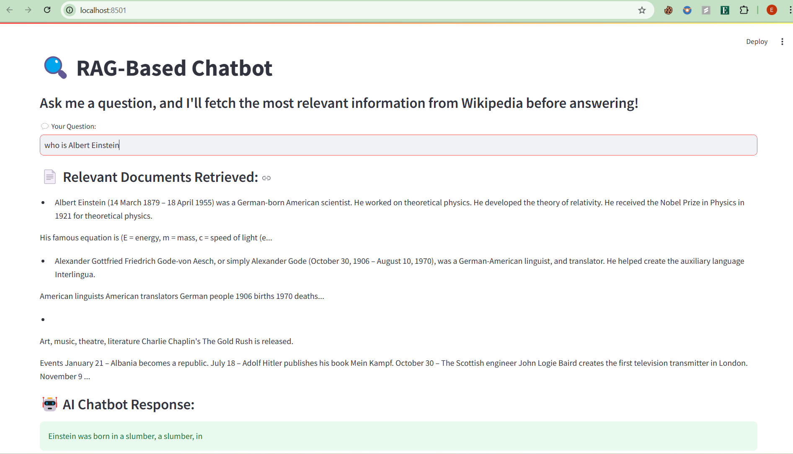

# 🔍 Retrieval-Augmented Generation (RAG) Chatbot

This project implements a **Retrieval-Augmented Generation (RAG) Chatbot** using:

- **FAISS** for fast document retrieval
- **T5 (Text-to-Text Transfer Transformer)** for LLM-based response generation
- **Wikipedia Dataset** as a knowledge base
- **Streamlit** for an interactive web UI

---

## 🚀 Features

✅ **Retrieves relevant Wikipedia documents using FAISS**  
✅ **Generates responses using T5 LLM (or T5-base as backup)**  
✅ **Interactive chatbot UI built with Streamlit**  
✅ **Precomputed FAISS index for efficient retrieval**  
✅ **Custom dataset creation from Wikipedia**

---

## 📁 Project Structure

```
/RAG_Chatbot_Project
│── app.py                  # Streamlit Chatbot UI
│── retrieval.py             # FAISS-based document retrieval
│── llm_generation.py        # LLM (T5) response generation
│── fetch_wikipedia.py       # Fetches Wikipedia dataset
│── requirements.txt         # Dependencies
│── README.md                # Project Documentation
│── data/
│   ├── wikipedia_sample.json # Wikipedia dataset (1000 articles)
│── models/
│   ├── faiss_index.bin       # Precomputed FAISS index
│   ├── t5-small/             # T5 Model (if manually downloaded)
```

---

## 🔧 Installation

### 1️⃣ **Clone the Repository**

```bash
git clone https://github.com/your-username/RAG_Chatbot_Project.git
cd RAG_Chatbot_Project
```

### 2️⃣ **Install Dependencies**

```bash
pip install -r requirements.txt
```

If `requirements.txt` is missing, install manually:

```bash
pip install faiss-cpu transformers sentence-transformers datasets streamlit torch
```

---

## 📥 Dataset Preparation

### **3️⃣ Fetch Wikipedia Data**

Run the following script to **download 1000 Wikipedia articles**:

```bash
python fetch_wikipedia.py
```

- This creates **`data/wikipedia_sample.json`**.

### **4️⃣ Build FAISS Index**

```bash
python retrieval.py
```

- This **indexes the Wikipedia dataset** using **FAISS**.
- Saves the index as **`models/faiss_index.bin`**.

---

## 🤖 Running the Chatbot

### **5️⃣ Start the Chatbot UI**

Run the chatbot using **Streamlit**:

```bash
streamlit run app.py
```

Then, open **`http://localhost:8501`** in your browser.

---

## 🛠 Troubleshooting

### **1. Model Download Issues**

If the T5 model fails to download, manually install it:

```bash
transformers-cli download google/t5-small
```

Then, move it to:

```
models/t5-small/
```

Modify `llm_generation.py` to use the **local model**:

```python
tokenizer = AutoTokenizer.from_pretrained("models/t5-small")
model = AutoModelForSeq2SeqLM.from_pretrained("models/t5-small")
```

### **2. Streamlit File Watcher Error (Windows)**

Run Streamlit with this flag:

```bash
streamlit run app.py --server.fileWatcherType none
```

### **3. FAISS Index Not Found**

If you get `faiss_index.bin` errors, rebuild the FAISS index:

```bash
python retrieval.py
```

---

## 📷 Screenshots

### **RAG Chatbot UI**



---

## 💡 Future Enhancements

- ✅ **Support real-time Wikipedia search**
- ✅ **Deploy as a web app (Hugging Face Spaces / Vercel)**
- ✅ **Allow users to upload custom datasets**
- ✅ **Add support for multi-modal RAG (text + images)**
